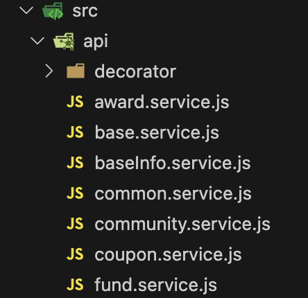
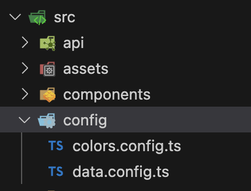
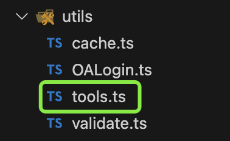

<!--
 * @Author: chengchunlin chengchunlin@eastmoney.com
 * @Date: 2024-03-22 13:46:09
 * @LastEditors: chengchunlin chengchunlin@eastmoney.com
 * @LastEditTime: 2024-03-22 14:50:47
 * @FilePath: /cfh-web/doc/平台使用手册.md
 * @Description: write something
 *
 * Copyright (c) 2024 by 天天基金/程春霖, All Rights Reserved.
-->

# 平台开发手册

## 命令行说明

- 本地调试：pnpm dev
- 打包: pnpm build-only
- 打包（检查ts）: pnpm build
- prettier检查&格式化: pnpm format
- eslint检查&格式化: pnpm lint

## 目录说明

> - doc # 组件、平台说明文档目录<br>
>   - 组件说明文档目录<br>
>     - CusRangePicker.md # 单个组件说明文档<br/>
>     - ...
>   - 平台使用手册 # 公测配置信息<br>
> - plugins # vite打包插件目录<br>
> - public # 公共资源目录<br>
> - src<br>
>   - api # 接口请求<br>
>     - fund.service.js # 单个接口文件<br>
>     - ...<br>
>   - assets # 静态文件<br>
>     - images<br>
>       -under_score_case.png # 图片文件<br>
>       ...<br>
>   - components # 全局组件(使用次数>=2)<br>
>     - PascalCase.vue # 单个全局组件<br>
>     - ...<br>
>   - config # 全局配置<br>
>     - PascalCase.config.ts # 单个配置文件<br>
>     - ...<br>
>   - router # vue-router<br>
>   - stores # vuex<br>
>   - types # ts声明文件<br>
>     - index.d.ts # 单个声明文件<br>
>     - ...<br>
>   - utils # 工具<br>
>     - kebab-case.js # 单个util文件<br>
>     - ...<br>
>   - views # 页面<br>
>     - kebab-case # 页面名称<br>
>       - components # 局部组件<br>
>         - PascalCase.vue # 单个局部组件<br>
>         - ...<br>
>       - index.vue # 页面级组件<br>
>   - main.ts<br>
> - .env.release # 生产环境配置<br>
> - .env.test # 开发环境配置<br>
> - ...<br>

## API规范

- 示例

  

- 文件命名规范

  > 参考接口路径，以模块名为关键字，以.service.[js|ts]结尾，示例：fund.service.js

- 如何使用
  > 无需导入，以[$+关键字+Api]为变量名，直接引用内部API方法，如下，
  >
  > ```javascript
  > const res = await $fundApi.getCompanyFundList();
  > ```

## config规范

- 示例

  

- 文件命名规范

  > 以配置内容为关键字，以.config.[js|ts]结尾，示例：colors.service.js

- 如何使用
  > 无需导入，以[$+关键字+Config]为变量名，直接引用内部配置，如下，
  >
  > ```javascript
  > const color = $colorsConfig.multicolor;
  > ```

## tools使用规范

- 文件

  

- 新增方法规范

  > 新增的函数、方法必须在export default内导出，如下，
  >
  > ```javascript
  > /** 为数字添加千分位分隔符 */
  > export const formatDigit = (num = '') => {
  >   num = num?.toString() || '';
  >   const reg = num.indexOf('.') > -1 ? /(\d)(?=(\d{3})+\.)/g : /(\d)(?=(\d{3})+$)/g;
  >   return num.replace(reg, '$1,');
  > };
  > export default {
  >   formatDigit
  > };
  > ```

- 如何使用
  > 无需导入，以$tools为变量名，直接引用内部方法，如下，
  >
  > ```javascript
  > const formatDigit = $tools.formatDigit(84263486);
  > ```
