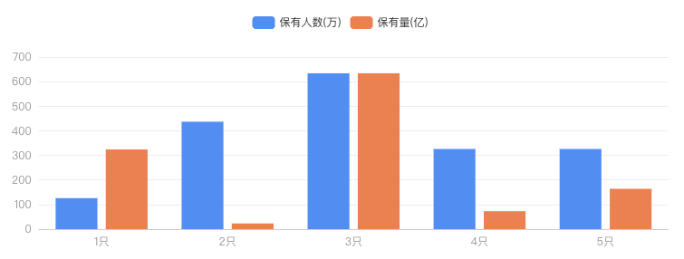

<!--
 * @Author: chengchunlin chengchunlin@eastmoney.com
 * @Date: 2024-03-15 15:13:30
 * @LastEditors: chengchunlin chengchunlin@eastmoney.com
 * @LastEditTime: 2024-03-15 15:54:30
 * @FilePath: /cfh-web/doc/组件说明文档/CusBarChart.md
 * @Description: write something
 *
 * Copyright (c) 2024 by 天天基金/程春霖, All Rights Reserved.
-->

# 折线图

- 开发人员：程春霖

### 效果图



### 属性说明

| 成员           | 说明                     | 类型           | 默认值 |
| -------------- | ------------------------ | -------------- | ------ |
| xAxisData      | x轴类目数据              | Array          | 无     |
| yAxisName      | y坐标轴名称              | String         | 无     |
| seriesDataList | 折线图系列数据           | Array          | 无     |
| extraOption    | 额外定制的echart配置数据 | Echarts.Option | 无     |

### 代码演示

```html
<CusBarChart :seriesDataList="seriesDataList" :xAxisData="xAxisData" :extraOption="extraOption" />
```

```javascript
const xAxisData = ['1只', '2只', '3只', '4只', '5只'];
const seriesDataList = [
  {
    name: '保有人数(万)',
    data: [126, 437, 634, 326, 326]
  },
  {
    name: '保有量(亿)',
    data: [324, 23, 634, 73, 164]
  }
];
const extraOption = {
  color: ['#96680C', '#C88A10', '#FAAD14', '#FBBD43', '#FDCE73']
};
```
