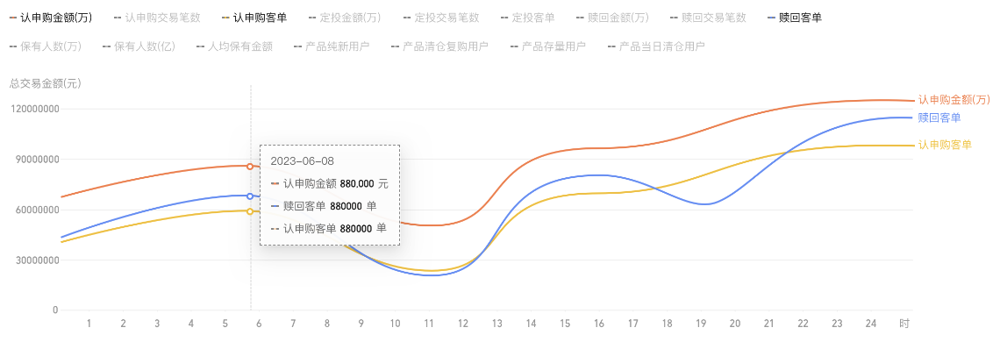

<!--
 * @Author: chengchunlin chengchunlin@eastmoney.com
 * @Date: 2024-03-15 15:13:30
 * @LastEditors: chengchunlin chengchunlin@eastmoney.com
 * @LastEditTime: 2024-03-15 15:54:45
 * @FilePath: /cfh-web/doc/组件说明文档/CusLineChart.md
 * @Description: write something
 *
 * Copyright (c) 2024 by 天天基金/程春霖, All Rights Reserved.
-->

# 折线图

- 开发人员：程春霖

### 效果图



### 属性说明

| 成员           | 说明                     | 类型           | 默认值 |
| -------------- | ------------------------ | -------------- | ------ |
| xAxisData      | x轴类目数据              | Array          | 无     |
| yAxisName      | y坐标轴名称              | String         | 无     |
| seriesDataList | 折线图系列数据           | Array          | 无     |
| extraOption    | 额外定制的echart配置数据 | Echarts.Option | 无     |

### 代码演示

```html
<CusLineChart
  :xAxisData="xAxisData"
  :seriesDataList="seriesDataList"
  :extraOption="extraOption"
  yAxisName="总交易金额(元)"
/>
```

```javascript
const xAxisData = ['02-29', '03-01', '03-02', '03-03', '03-04', '03-05', '03-06', '03-07'];
const seriesDataList = [
  {
    name: '昨日',
    data: [0, 0, 0, 0, 0, 0, 4, 0]
  },
  {
    name: '今日',
    data: [0, 0, 0, 0, 0, 0, 0, 0]
  }
];
const extraOption = {
  grid: {
    top: 68,
    bottom: 0
  },
  legend: {
    top: 0,
    bottom: 'auto'
  },
  tooltip: {
    formatter(params) {
      const [{ data: yesterday }, { data: today }] = params;
      return `${today.date} ${today.name} <br/> 今日：${today.value}万元 <br/>昨日：${yesterday.value}万元`;
    }
  }
};
```
