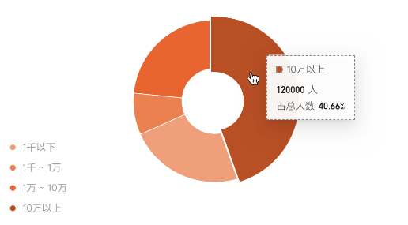

<!--
 * @Author: chengchunlin chengchunlin@eastmoney.com
 * @Date: 2024-03-15 15:13:30
 * @LastEditors: chengchunlin chengchunlin@eastmoney.com
 * @LastEditTime: 2024-03-15 15:54:48
 * @FilePath: /cfh-web/doc/组件说明文档/CusPieChart.md
 * @Description: write something
 *
 * Copyright (c) 2024 by 天天基金/程春霖, All Rights Reserved.
-->

# 饼图

- 开发人员：程春霖

### 效果图



### 属性说明

| 成员           | 说明                     | 类型           | 默认值 |
| -------------- | ------------------------ | -------------- | ------ |
| seriesDataList | 折线图系列数据           | Array          | 无     |
| extraOption    | 额外定制的echart配置数据 | Echarts.Option | 无     |

### 代码演示

```html
<CusPieChart :seriesDataList="seriesDataList" :extraOption="extraOption" />
```

```javascript
const seriesDataList = [
  {
    name: '持仓规模分布',
    data: [
      {
        name: '51岁以上',
        value: 126
      },
      {
        name: '41-50岁',
        value: 437
      },
      {
        name: '31-40岁',
        value: 634
      },
      {
        name: '21-30岁',
        value: 326
      },
      {
        name: '20岁以下',
        value: 326
      }
    ]
  }
];
const extraOption = {
  color: ['#96680C', '#C88A10', '#FAAD14', '#FBBD43', '#FDCE73']
};
```
