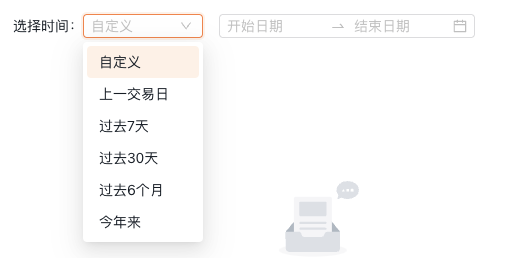

<!--
 * @Author: chengchunlin chengchunlin@eastmoney.com
 * @Date: 2024-03-15 15:13:30
 * @LastEditors: chengchunlin chengchunlin@eastmoney.com
 * @LastEditTime: 2024-03-21 14:22:55
 * @FilePath: /back-template/doc/组件说明文档/CusRangePicker.md
 * @Description: write something
 *
 * Copyright (c) 2024 by 天天基金/程春霖, All Rights Reserved.
-->

# 折线图

- 开发人员：程春霖

### 效果图



### 属性说明

| 成员  | 说明 | 类型   | 默认值                                               |
| ----- | ---- | ------ | ---------------------------------------------------- |
| value | 时间 | Object | { type: Number, default: { timeType: 2, time: '' } } |

### 事件

| 事件名称 | 说明                                                   | 回调参数                                                                     |
| -------- | ------------------------------------------------------ | ---------------------------------------------------------------------------- |
| change   | 选中 option，或 datePicker 的 value 变化时，调用此函数 | function(value:{ timeType:Number, time: [dayjs, dayjs] \| [string, string]}) |

### 代码演示

```html
<CusRangePicker v-model:value="timeValue" @change="onChangeTime" />
```

```javascript
import { ref } from 'vue';
import CusRangePicker from '@/components/CusRangePicker.vue';

const timeValue = ref({ timeType: 2, time: '' });

const onChangeTime = (data) => {
  const { timeType: type, time: dateTime } = data;
  timeValue.value = data;
  if (type === 1 && !dateTime) return;
  ...
};
```
