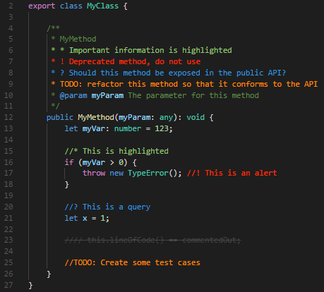
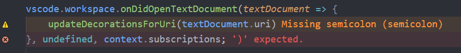
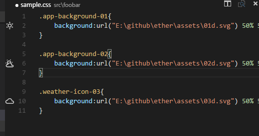
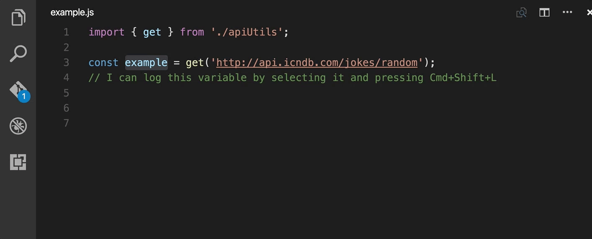
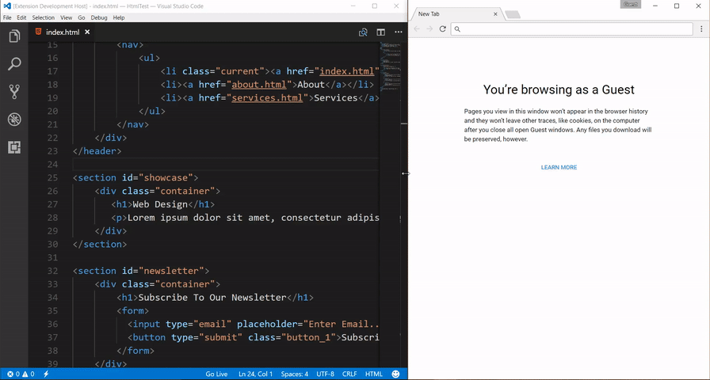
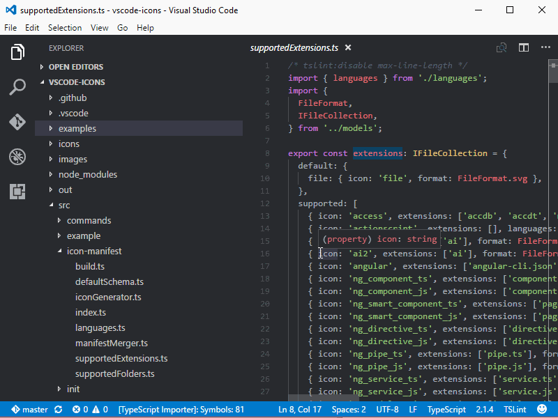

<!--
 * @Author: chengchunlin chengchunlin@eastmoney.com
 * @Date: 2024-07-03 19:44:52
 * @LastEditors: chengchunlin chengchunlin@eastmoney.com
 * @LastEditTime: 2024-07-03 20:07:51
 * @FilePath: /个人项目/src/views/vscode/docs/vscode常用插件.md
 * @Description: write something
 *
 * Copyright (c) 2024 by 天天基金/程春霖, All Rights Reserved.
-->

- ### Auto Close Tag

 自动添加HTML/XML关闭标签，与Visual Studio IDE或Sublime Text相同。

- ### Auto Rename Tag

 自动重命名成对的HTML/XML标记，与Visual Studio IDE相同。

- ### Bash Beautify

 基于"Paul Lutus - Bash脚本美化器"的shell脚本格式化工具

- ### Better Comments

 Better Comments扩展将帮助您在代码中创建更人性化的注释。
 

- ### Chinese

 此中文（简体）语言包为 VS Code 提供本地化界面。

- ### Code Spell Checker

 一个基本的拼写检查器，可以很好地处理代码和文档。

- ### Color Highlight

 css/web颜色高亮。

- ### Error Lens

 ErrorLens增强了语言诊断功能，使诊断更加突出，在语言生成诊断的地方突出显示整行，并内联打印消息。
 

- ### ESLint

 将ESLint集成到VS Code中。如果你是ESLint的新手，请查看文档。

- ### GitLens — Git supercharged

 vscode的Git工具。

- ### Image preview

 在gutter和hover中显示图像预览
 

- ### JavaScript (ES6) code snippets

 这个扩展包含了vscode编辑器的ES6语法JavaScript代码片段(支持JavaScript和TypeScript)。

- ### javascript console utils

 通过@whtouche轻松插入和删除console.log语句
 

- ### koroFileHeader

 用于一键生成文件头部注释并自动更新最后编辑人和编辑时间、函数注释自动生成和参数提取。

- ### Live Server

 启动具有静态和动态页面实时重新加载功能的本地开发服务器。
 

- ### Markdown TOC

 一个Visual Studio Code扩展，可为您的markdown文件生成目录表。

- ### Minify

 缩小你的js, css和html文件，以节省传输带宽。

- ### Prettier - Code formatter

 Prettier是一个固执己见的代码格式化器。它通过解析代码并使用自己的规则(考虑到最大行长度)重新打印代码，并在必要时包装代码，从而实现一致的风格。

- ### SVG

 一个强大的SVG语言支持扩展。处理SVG所需的几乎所有特性。

- ### Todo Tree

 这个扩展快速搜索(使用ripgrep)您的工作区评论标签，如TODO和FIXME，并在活动栏的树视图中显示它们。视图可以从活动栏拖到资源管理器窗格中(或者您喜欢的任何位置)。

- ### VS Code Counter

 VS Code扩展:在许多编程语言中计算源代码的空白行、注释行和物理行。

- ### vscode-icons

